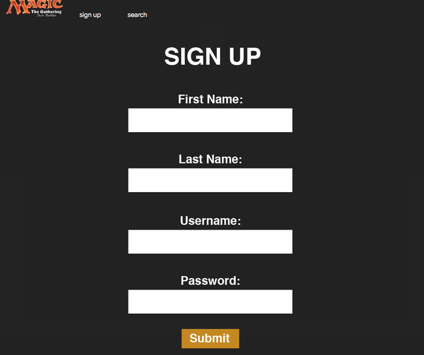
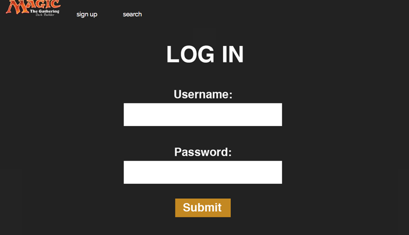
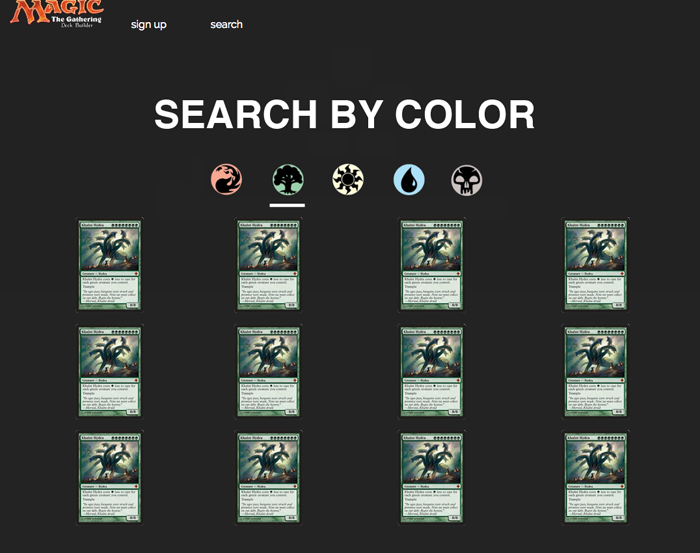
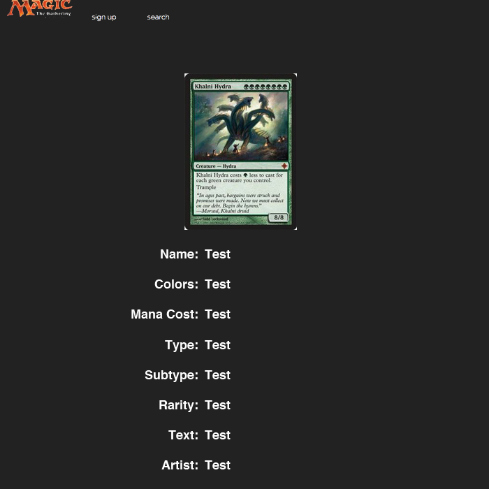
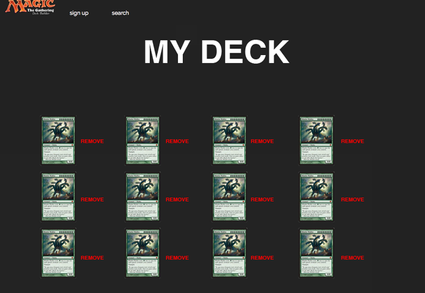

(https://magic-deckbuilder.herokuapp.com)

# Synopsis
A MEAN stack app that queries Magic: The Gathering API (http://magicthegathering.io/), allows the user to add the cards to their own deck, and take their deck with them wherever they go.

# Languages, libraries, and frameworks used:
HTML, CSS, Javascript, jQuery, AngularJS, Express.js, MongoDB

# MVP
- [x] Site/App with page views: 
	- index
	- search
	- card show page
	- user home
	- user deck

- [x] User Login/logout

- [x] card search

# User Stories
- User will see home screen when they load the app
- User will be able to create a unique username and password
- Users will be able to sign into app
- Users will be able to log out of their session
- Users will be able to search

# Stretch Goals 
- User will be able to advance search by multiple variables
- User will be able to access a unique view for their activity with deck(s) they are building
- Users will be able to add a card to their "decks" (add card to a specific deck)
- Users who are not logged in can do simple and advanced searches but cannot add cards
- User can name decks
- User will be able to delete cards from deck
- User will be able to edit info about their deck (name, ...)
- User can delete deck(s)
- User can see some relevant analysis of the deck they've been building (mana curve, color distribution, suggested land count)

# Wireframe

# Approach
A MEAN stack app that connects the front end functionality of angular.js with the backend power of MongoDB and express. 

It creates users in the DB and can put them in or pull their info for signup or login. It searches an api (magic the gathering DB) for cards of certain color and then loads the results, saving a json for immediate retrieval of those colored cards (a new search replaces the json). If a user is logged in then they can save a card to their deck and then the card can be called up from their deck which is stored in the DB.

# Live Site Link

(https://magic-deckbuilder.herokuapp.com)

#Installation Instructions
N/A

# Unsolved Problems
- Message about an empty deck still appears even after a card is added.
